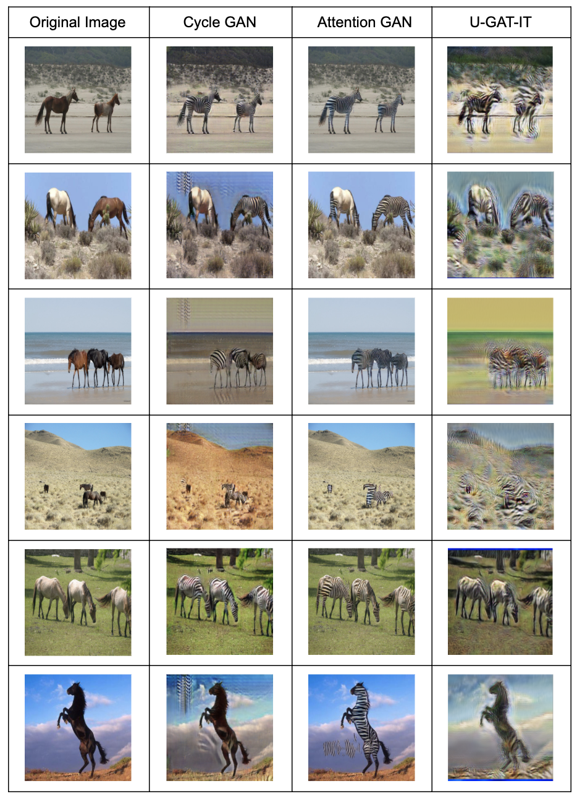

# Review on GAN Models with Unpaired Dataset

Generative Adversarial Networks (GAN) are the model that have been widely used to solve the image-to-image translation, mapping an image from a source domain to a target domain. The accessible fields including colorization, super-resolution, style transfer, etc. We did the research review focusing on those who implemented GANs on unpaired datasets. Although there are plenty of GANs, we chose **CycleGAN**, **AttentionGAN**, and **U-GAT-IT** among all.

This repository is mainly for learning and record use. Despite details in existing repositories, for easy use, we wrote the simple instructions how we implemented them, translated images we obtained from these models and also provided related resources for GANs. Here we worked on `Horse2zebra` dataset, and we also provided a custom horse dataset (`horse.zip`) to do addtional test.

For original code and implementation, please visit official repositories : [Pytorch-CycleGAN-and-pix2pix](https://github.com/junyanz/pytorch-CycleGAN-and-pix2pix), [AttentionGAN](https://github.com/Ha0Tang/AttentionGAN), [U-GAT-IT](https://github.com/znxlwm/UGATIT-pytorch).


## Review Models

### 1. CycleGAN 
- Package Setup
   - Clone the repository using below command :
   		```
    	$ git clone https://github.com/junyanz/pytorch-CycleGAN-and-pix2pix
    	$ cd pytorch-CycleGAN-and-pix2pix
    	```

	- After cloning the repo, change current directory to `/Path/To/pytorch-CycleGAN-and-pix2pix`
	
- Prerequisites

		- Pytorch >= 1.4.0
		- Torchvision > 0.5.0
		- Dominate >= 2.4.0
		- Visdom >=1.8.8.0
 Make sure to have the dependencies ready : `pip install -r requirements.txt`
 
- Prepare Dataset
	- Download the dataset :
		```
		$ bash ./datasets/download_cyclegan_dataset.sh <dataname>
		```
    
       `<dataname>` : name of dataset, here we used **horse2zebra**, but there are still other available datasets
       		      e.g. "summer2winter_yosemite", "monet2photo", "cezanne2photo", "ukiyoe2photo", "vangogh2photo", "maps", "facades", "iphone2dslr_flower", "ae_photos", and "apple2orange".

    - The file strucuture of dataset:
    	```
    	.
    	|-- datasets
    	|	|-- horse2zebra
    	|	|	|-- trainA
    	|	|	|-- trainB
    	|	|	|-- testA
    	|	|	|-- testB
    	|-- ...(other files)
    	```
- Load Trained Model
    
    There are details showing how to train and test from scratch in official repo, however, we only show the instruction on how to apply trained model and test.
	
    - Download corresponding pretrained model using following command :
		```
		$ bash ./scripts/download_cyclegan_model.sh horse2zebra
		```
      The pretrained model located in `./checkpoints/horse2zebra/`.


- Test Model & Results
	
	The pretrained model used the image inside `./datasets/horse2zzebra/test*`, therefore, if you would like to experiment custom images, modified images inside`testA` and `testB`.
	```
	$ python test.py --dataroot datasets/horse2zebra/testA --name horse2zebra_pretrained --model test --no_dropout --gpu_ids -1
	```
	- `--model test` : generating results of CycleGAN for one side. This option will automatically set `--dataset_model single`, which only loads the image from one set. 
	
	- `--gpu_ids -1` :  The default setting is using GPU, in our case, we only used CPU so the argument needed to be added.
	- After running the command, the default results will be created at `./results/horse2zebra_pretrained`, otherwise, use `--result_dir` to specify the result directory
    
     - For more details of command arguments, please check `$ python test.py --help`

### 2. AttentionGAN
- Package Setup
    Clone the repository:
    ```
    $ git clone https://github.com/Ha0Tang/AttentionGAN
    $ cd AttentionGAN/
    ```
    After cloning the repo, change current directory to `/Path/To/AttentionGAN`
- Prerequisites

       - Pytorch >= 0.4.1
       - Python >= 3.6.9
       - (To reproduce same results in the paper) NVIDIA Tesla V100 with 16G memory
    The dependencies can be installed using: 
    
    1. For pip users:  `pip install -r requirements.txt`
    2. For conda users : `./scripts/conda_deps.sh`

- Prepare Dataset
    ```
    $ sh ./datasets/download_cyclegan_dataset.sh {dataset_name}
    ```
    Available `{dataset_name}` : apple2orange, horse2zebra, maps, cezanne2photo, monet2photo. Here we used **horse2zebra**.
    This will create the file under `./datasets/{dataset_name}`, and there are images inside train A/B and test A/B files.
    If you would like to use custom images, put the images inside testA for horse2zebra, and testB vice versa.
- Load Trained Model
Here we used pretrained model provided by the authors, and the details can be found inside the official repo too. For downloading the pretrained model for horse2zebra :
    ```
    $ sh ./scripts/download_attentiongan_model.sh horse2zebra
    ```
    The pretrained model will generate at `./checkpoints/{name}_pretrained`.

- Test Model & Results
    To generate results from pretrained model, use below command : 
    ```
    $ python test.py --dataroot ./datasets/horse2zebra --name horse2zebra_pretrained --model attention_gan --dataset_mode unaligned --norm instance --phase test --no_dropout --load_size 256 --crop_size 256 --batch_size 1 --gpu_ids -1 --num_test 5000 --epoch latest --saveDisk
    ```
    - `--gpu_ids -1 ` : for the usage of CPU. 
    - The arguements inside the command are modifiable. For further argument details, can be found by `$ python test.py --help`.
    
### 3. U-GAT-IT

For U-GAT-IT, we could not find the pretrained model. Therefore, we trained the model using the existing code, and generated the images by our own trained model. Below provides the details training and testing instructions.

- Package Setup

    Clone the repository using below command :
    ```
    $ git clone https://github.com/znxlwm/UGATIT-pytorch.git
    $ cd UGATIT-pytorch
    ```
    After cloning the repo, change current directory to `/Path/To/UGATIT-pytorch`
    
- Prepare Dataset

    Here we used the same horse2zebra dataset generated in previous sections.
    
    The dataset file is located in : `./dataset/{data_name}`

- Train Model

     - Start Training  
        ```
        $ python main.py --dataset horse2zebra --light True
        python main.py --dataset horse2zebra --light True --resume True --save_freq 100 --iteration 1000
        ```
	- During the training, the code set up a default 1000 for printing out intermediate results, which can be modified adding `--print_freq #` to the command. 
        - The intermediate model will be stored at `./results/horse2zebra_params_latest.pt`, and the intermediate results will be put at `./results/horse2zebra/img`.
        - The final model is stored in `./results/horse2zebra/model/horse2zebra_params_0000000.pt`
        - The representation of model name: `{data_name}_params_0000000.pt`, where `0000000` represents epochs, e.g. `0012000`.
        
    -  Resume Training
        ```
        $ python main.py --dataset horse2zebra --light True --resume True --iteration 12000 --save_freq 100
        ```
        `--light True` : set to true, if the memory of gpu is not sufficient
        `--iteration #` : how many training epochs
        `--save_freq #` : frequency of saving the model, e.g. --save_freq 100 meaning every 100 epochs will automatically save the model
        Besides mentioned arguments, check `$python main.py --help` to modify.
        
    - Training result:
     
    	Time: 3183.4438, d_loss: 3.55653095, g_loss: 562.96545410
    
    	Here we only trained the model ([horse2zebra_params_0012000.pt](https://drive.google.com/file/d/1YK7jTquCobc9dMoKlfOyyNk-VQcqM1_A/view?usp=sharing)) under 12,000 epochs, due to the lack of suffcient hardware. The default training epochs is 1,000,000, therefore, our results are not competitive as provided in the paper.

- Test Model & Results

    - To generate the results using trained model, make sure you
        ```
        $ python main.py --dataset horse2zebra --light True --phase test
        ```
		- `--phase test` : default is training, set to "test" for generating the results.
		- `--light True` : set to true, if the memory of gpu is not sufficient
		- For more argument details, can be found : `$ python main.py --help`
    - The images are stored at `./results/horse2zebra/test`

## Our Implemented Results (Based on Custom Horse Dataset)

The table below shows the translated images that we applied on these three models with the same custom image set. Due to the lack of trained U-GAT-IT model, our results are not promising as the paper provided.




From the results, although CycleGAN provides good translated images, AttentionGAN and U-GAT-IT also have slightly shown better results.
AttentionGAN is able to preserve the unrelated part, and background for the generated images, and U-GAT-IT is able to keep the geometric changes. With all pros and cons, there are still some improvements can be done to get better results

## Repository Files

- `horse.zip` : Our custom horse test images
- `Review_Report.pdf` : Details the conclusion that we have after implementing and comparing these three GAN models


## Related Models

- BycleGAN
- AsymmetricGAN


## Reference
- J-Y. Zhu, T. Park, P. Isola, and A. A Efros, "*Unpaired Image-to-Image Translation using Cycle-Consistent Adversarial Networks*", Computer Vision (ICCV), 2017 IEEE International Conference
-  H. Tang, H. Liu, D. Xu, P. H. S. Torr and N. Sebe, “*AttentionGAN: Unpaired Image-to-Image Translation using Attention-Guided Generative Adversarial Networks*”, in CoRR, abs/1911.11897, 2019
- J. Kim, M. Kim, H. Kang and K. Lee, “*U-GAT-IT: Unsupervised Generative Attentional Networks with Adaptive Layer-Instance Normalization for Image-to-Image Translation*” arXiv 1907.10830, 2020

## Constributors
[Chieh-Hsi Lin](https://github.com/chiehhsi), [HyeongHwan Kwon](https://github.com/hkwon31)
